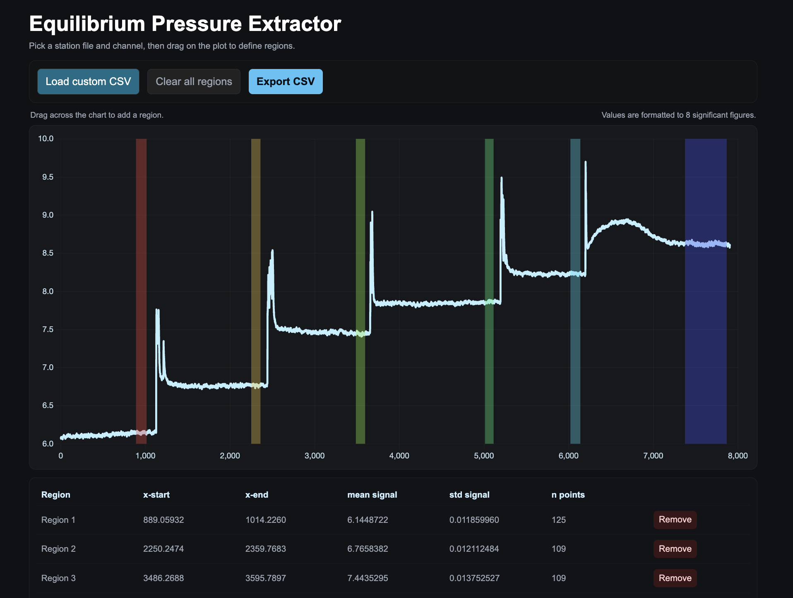

# Equilibrium Pressure Extractor

An interactive web-based tool for easily analyzing VLE (Vapor-Liquid Equilibrium) lab pressure data from lab experiments (specifically designed for CHEG345 at UD). I was looking around for a simple tool with all the functionality I needed to quickly analyze pressure signals and couldn't find it. So I made it! 

## Features

- **Load CSV Files**: Upload custom data files with time and signal columns
- **Interactive Chart**: Visualize pressure/signal data with Chart.js
- **Region Selection**: Drag on the chart to define equilibrium regions
- **Region Editing**: 
  - Drag region edges to resize
  - Drag region middle to move
  - Remove individual regions
- **Statistical Analysis**: Automatically calculates mean, standard deviation, and point count for each region
- **Export Results**: Export region statistics as a sorted CSV file

## Usage

1. Open `equilibrium_pressures.html` in a web browser
2. Click **Load custom CSV** to select your data file
3. The tool expects CSV format with at least 2 columns:
   - **Column 1**: Time values (numeric, ISO datetime, or HH:MM:SS.microseconds format)
   - **Column 2**: Signal/pressure values (numeric)
4. Drag on the chart to create regions
5. Resize or move regions as needed (you can drag them! or remove them individually or all at once)
6. Click **Export CSV** to download region statistics sorted by x_start

## Export Format

The exported CSV contains:
- `region`: Region number (sorted by x_start)
- `x_start`: Start time of region
- `x_end`: End time of region
- `mean_signal`: Mean signal value in region
- `std_signal`: Standard deviation of signal in region
- `n_points`: Number of data points in region

All values are formatted to 8 significant figures.

## Technologies

- [Chart.js 4.3.0](https://www.chartjs.org/) - Chart visualization
- [PapaParse 5.3.2](https://www.papaparse.com/) - CSV parsing
- Modern browser with File System Access API support (fallback to standard download)

## Notes

- Time values are automatically normalized relative to the first data point
- Hover over regions to see edit options (resize edges or move)
- Clear all regions with the **Clear all regions** button
